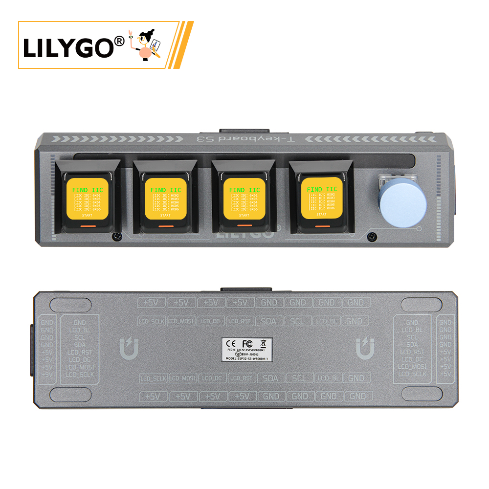

<!-- **[English](README.MD) | 中文** -->

<!-- 

    <a target="_blank" style="margin: 1em;color: white; font-size: 0.9em; border-radius: 0.3em; padding: 0.5em 2em; background-color:rgb(63, 201, 28)" href="https://item.taobao.com/item.htm?id=846226367137">淘宝</a>
    <a target="_blank" style="margin: 1em;color: white; font-size: 0.9em; border-radius: 0.3em; padding: 0.5em 2em; background-color:rgb(63, 201, 28)" href="https://www.aliexpress.com/store/911876460">速卖通</a>

 -->
>! A host device is required during use; slave devices connect to the host via magnetic connectors.
## Introduction

T-Keyboard-S3 Pro is a high-end programmable keyboard based on a dual-MCU architecture (ESP32-S3 + STM32G030F6P6), designed for developers and professional users.

Its standout features include four 0.85-inch RGB LCD screens (128×128 resolution), each capable of displaying independent shortcut commands, system status, or dynamic UI interfaces. These displays are driven via an SPI interface (MOSI/SCLK), enabling efficient visual interaction.

The keyboard features four hot-swappable mechanical keys that support customizable switch types, along with RGB WS2812 lighting effects and a rotary encoder (Data-A/B pins) for programmable backlighting and precise parameter control—such as volume or scroll adjustments.

On the hardware side, the main ESP32-S3 controller is equipped with 8MB Flash and 16MB PSRAM, supporting Wi-Fi/Bluetooth connectivity and complex logic processing. An external STM32 chip communicates via the I2C bus (SDA: IO06/IO42, SCL: IO07/IO02) and is dedicated to handling real-time input tasks, ensuring low-latency responsiveness.

In terms of expandability, the board offers STEMMA QT/Qwiic, JST-SH 4-PIN interfaces, and I2C expansion for up to 5 slave devices. This allows connection to sensors, touchpads, and other peripherals, making it an ideal platform for building versatile control terminals.

## Appearance and function introduction
### Appearance

### Pinmap 

## Module Information and Specifications
### Notes

>! The default firmware is configured for I2C communication expansion mode. Please note that when adding multiple slave devices, each must have a unique I2C address to avoid conflicts. Slave devices cannot operate independently and must be used within a system where one host communicates with multiple slaves.
>! Up to 6 devices can be connected. When using multiple devices, the maximum brightness of the on-board LED should be reduced to 10.
>! Due to hardware limitations from long-distance wiring, the expansion directions of the board are restricted. Only one device can be added to each side of the main board (left and right), and up to two devices can be added downward (USB ports may obstruct downward expansion).
>This configuration supports a maximum 2×3 grid layout, allowing up to 6 devices in total.
### Description

| Component | Description |
| ---  | --- |
|MCU	|ESP32-S3R8 Dual-core LX7 microprocessor
|Flash 	|16M 
|PSRAM  |8M
|GPS	|MIA-M10Q
|Wireless| 	Wi-Fi 802.11 b/g/n，BLE 5
|Storage | TF card |
|Display|  0.85 inch All ViewTFT LCD The host device features four screen buttons, while each slave device includes five buttons.
|Buttons | 1 x RST Buttons   1 x BOOT Button and Rotary Encoder   4 × Screen Buttons |
| USB |1 × type-C Interfaces|
|UI | LVGL
| Expansion Interfaces | 2 × QWIIC Interfaces + 4 × Magnetic Connector|
| Dimensions | **164x46x42mm**  |

<table role="table" class="center_table">
  <thead>
    <tr>
      <th colspan = "2">STM32 Module</th>
    </tr>
  </thead>
    <tr>
    <td>MCU</td>
    <td>STM32G030F6P6</td>
  </tr>
  <tr>
    <td>Flash</td>
    <td>64kb</td>
  </tr>
  <tr>
    <td>PSRAM</td>
    <td>8kb</td>
  </tr>
</table>

### Related Links
Github：[T-Keyboard S3 Pro](https://github.com/Xinyuan-LilyGO/T-Keyboard-S3-Pro)

* [ESP32­-S3-WROOM­-1](https://www.espressif.com/sites/default/files/documentation/esp32-s3-wroom-1_wroom-1u_datasheet_en.pdf)
* [STM32G030F6P6](https://www.st.com/en/microcontrollers-microprocessors/stm32g030f6.html#documentation)
* [GC9107](https://github.com/Xinyuan-LilyGO/T-Keyboard-S3-Pro/blob/main/information/GC9107_DataSheet_V1.2.pdf)
* [WS2812C](https://github.com/Xinyuan-LilyGO/T-Keyboard-S3-Pro/blob/main/information/WS2812C-2020.pdf)

#### Schematic Diagram

[T-Keyboard S3 Pro](https://github.com/Xinyuan-LilyGO/T-Keyboard-S3-Pro/blob/main/project/SCH_T-Keyboard-S3-Pro_Keyboard_V1.1.pdf)

<!-- * [SY6970](./datasheet/AN_SY6970.pdf) -->

#### Dependency Libraries

* [RadioLib](https://github.com/Xk-w/Arduino_DriveBus)
* [TFT_eSPI](https://github.com/Bodmer/TFT_eSPI)
* [LVGL](https://github.com/lvgl/lvgl/tree/v8.4.0)
* [Arduino_GFX](https://github.com/moononournation/Arduino_GFX)

## Software Design
### Arduino Set Parameters

| Arduino IDE 设置  | Value      |
| --------------- | ------------------ |
| Board      | **ESP32S3 Dev Module**            |
| Port           | Your port                   |
| USB CDC On Boot          | Enable                    |
| CPU Frequency           | 240MHZ(WiFi)                 |
| Core Debug Level        | None                     |
| USB DFU On Boot         | Disable                           |
| Erase All Flash Before Sketch Upload | Disable        |
| Events Run On       | Core1            |
| Flash Mode       | QIO 80MHZ                         |
| Flash Size       | **16MB(128Mb)**                   |
| Arduino Runs On    | Core1          |
| USB Firmware MSC On Boot  | Disable           |
| Partition Scheme    | **16M Flash(3M APP/9.9MB FATFS)** |
| PSRAM    | **OPI PSRAM**           |
| Upload Mode       | **UART0/Hardware CDC**            |
| Upload Speed    | 921600                            |
| USB Mode         | **CDC and JTAG**                  |
  

### Development Platform
1. [ESP-IDF](https://www.espressif.com/zh-hans/products/sdks/esp-idf)
2. [Arduino IDE](https://www.arduino.cc/en/software)

## Product Technical Support  

