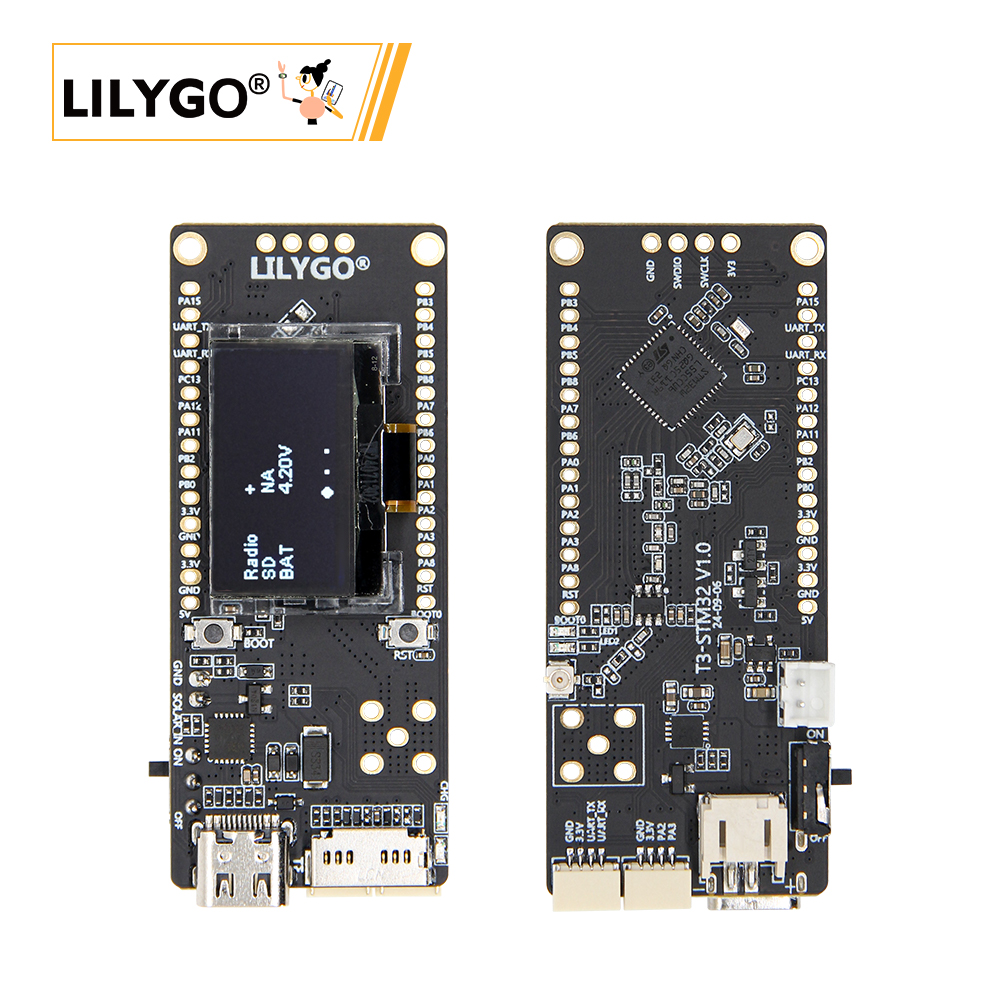

<!-- **[English](README.MD) | 中文** -->

<!-- 

    <a target="_blank" style="margin: 1em;color: white; font-size: 0.9em; border-radius: 0.3em; padding: 0.5em 2em; background-color:rgb(63, 201, 28)" href="https://item.taobao.com/item.htm?id=846226367137">淘宝</a>
    <a target="_blank" style="margin: 1em;color: white; font-size: 0.9em; border-radius: 0.3em; padding: 0.5em 2em; background-color:rgb(63, 201, 28)" href="https://www.aliexpress.com/store/911876460">速卖通</a>

 -->

## Introduction

LILYGO LORA32 TCXO is a wireless communication module based on LoRa technology, supporting dual-band frequencies (868/915MHz) to accommodate IoT applications across various global regions. The module is equipped with a temperature-compensated crystal oscillator (TCXO), which significantly improves frequency stability—ideal for high-precision communication in environments with large temperature fluctuations.

Its design integrates LoRa modulation technology with a 32-bit microcontroller, enabling long-range, low-power data transmission along with local processing capabilities. This makes it well-suited for applications such as smart agriculture, remote sensing, and industrial monitoring.

## Appearance and function introduction
### Appearance

### Pinmap 

## Module Information and Specifications
### Description

| Component | Description |
| --- | --- |
| MCU | ESP32-Pico-D4 |
| FLASH| 4MB |
| PSRAM | 2MB|
| Display | 1306 IIC-driver OLED
| LoRa | SX1276: 868, 915 MHz
| Storage | TF Card
|Wireless | Wi-Fi + Bluetooth V4.2 + BLE
|USB | 1 × USB Port and OTG (Type-C interface)
|IO Interface | 2×13 dual-row expansion IO interface, 2.54mm pitch
|Expansion Interfaces | 1 × Antenna Socket, 1 × Antenna Connector, 2 × QWIIC Interfaces
Buttons | 1 × RESET Button + 1 × BOOT Button
|Power Supply | USB / 3.7V Li-ion Battery, Battery Switch, Solar Input Interface
|Mounting Holes | 2 × 2mm Positioning Holes
|Dimensions | 66 × 27 × 13 mm
### Related Links

Github:[T3-TXCO](https://github.com/Xinyuan-LilyGO/LilyGo-LoRa-Series)

#### Schematic Diagram

[T3-TXCO](https://github.com/Xinyuan-LilyGO/LilyGo-LoRa-Series/blob/master/schematic/T3_V3.0.pdf)

#### Dependency Libraries

- [u8g2](https://github.com/olikraus/u8g2)
- [XPowersLib](https://github.com/lewisxhe/XPowersLib)
- [LoRa](https://github.com/sandeepmistry/arduino-LoRa)

## Software Design
### Arduino Set Parameters

|Setting  | Value              |
|Board	|ESP32 Dev Module
|Port	|Your port
|CPU Frequency	|240MHZ(WiFi/BT)
|Core Debug Level|	None
|Erase All Flash Before Sketch Upload	|Disable
|Events Run On	|Core1
|Flash Frequency	|80MHZ
|Flash Mode	|QIO
|Flash Size	|4MB(32Mb)
|JTAG Adapter	|Disabled
|Arduino Runs On	|Core1
|Partition Scheme	|Default 4M Flash with spiffs(1.2M APP/1.5MB SPIFFS)
|PSRAM	|Disable
|Upload Speed	|921600
|Programmer	|Esptool

### Development Platform
1. [VS Code](https://code.visualstudio.com/)
2. [Arduino IDE](https://www.arduino.cc/en/software)
3. [Platform IO](https://platformio.org/)

## Product Technical Support 

