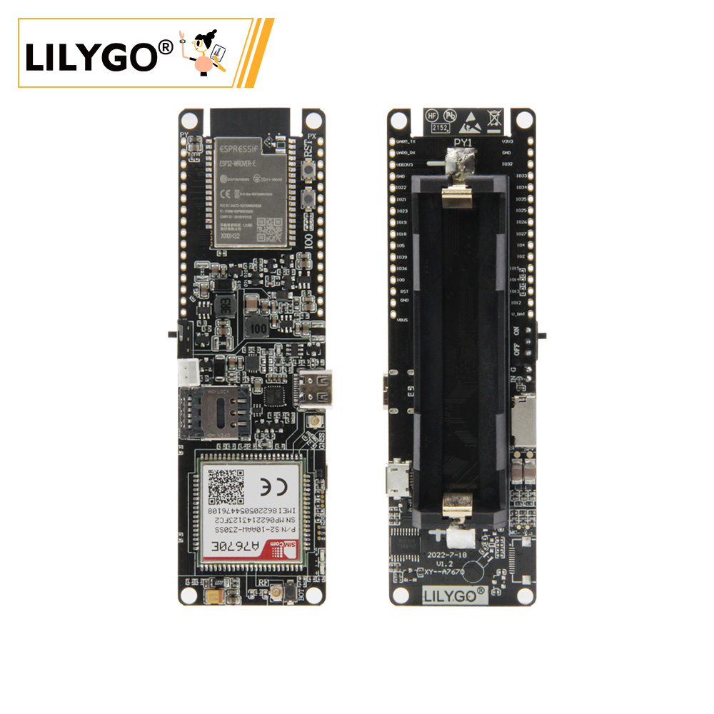

<!-- **[English](README.MD) | 中文** -->

>The differences of the T-A76xx series can be referred to in [SIM](../../SIM.md)

<!-- 

    <a target="_blank" style="margin: 1em;color: white; font-size: 0.9em; border-radius: 0.3em; padding: 0.5em 2em; background-color:rgb(63, 201, 28)" href="https://item.taobao.com/item.htm?id=846226367137">淘宝</a>
    <a target="_blank" style="margin: 1em;color: white; font-size: 0.9em; border-radius: 0.3em; padding: 0.5em 2em; background-color:rgb(63, 201, 28)" href="https://www.aliexpress.com/store/911876460">速卖通</a>

 -->

## Introduction

LILYGO T-A7670E R2 is a 4G LTE Cat1 communication module designed for IoT development, based on the A7670E chip. It supports GSM/GPRS/EDGE and multi-band 4G networks (covering regions like Europe, the Middle East, Africa, South Korea, and Thailand), and is compatible with Nano SIM cards. 
The hardware integrates rich interface resources, including 12 GPIOs (supporting ADC/DAC and touch sensing), SPI, I2C, UART serial ports, and an internal TF card storage expansion interface for data caching. The onboard power management supports a wide voltage input of 3.3V to 5V, adaptable to USB power supply and low-power scenarios. 
It also provides SPI (MOSI/MISO/SCK/CS) and I2C (SCL/SDA) pins for connecting sensors or peripherals. It is suitable for IoT applications requiring reliable mobile data transmission, such as smart security, remote monitoring, and vehicle terminals, providing developers with a quick hardware solution for deploying 4G communication.

## Appearance and function introduction
### Appearance

### Pinmap 

## Module Information and Specifications
### Description

| Component | Description |
| --- | --- |
| MCU | ESP32-WROVER-E |
| FLASH| 4MB |
| PS RAM | 8MB|
| Clock Frequency | 240MHz |
| Wireless | Wi-Fi: 802.11 b/g/n; BLE V5.0 |
| IO Expansion	|2.54mm spacing × 2*13 expansion IO interfaces + 1 × 4.4V~6.0V input interface|
| Battery Capacity | 18650 model battery |
| Storage | TF card |
| Voice Call | Supports voice function
| Buttons | 1 x RST button  + 1 x BOOT button  + 1 × IO0 button  |
| USB | 1 × USB Port and OTG(Type-C) |
| SIM | Supports 2G, 3G, 4G (Nano SIM)
| Power | 5V/500mA input|
| Dimensions | **111x34x19mm**  |

 
<table role="table" class="center_table">
  <thead>
    <tr>
      <th colspan = "2">Wireless Communication Module</th>
    </tr>
  </thead>
    <tr>
    <td>MCU</td>
    <td>A7670E</td>
  </tr>
  <tr>
    <td>Supported Regions</td>
    <td>Europe, Middle East, South Korea, Thailand</td>
  </tr>
  <tr>
    <td>Dimensions</td>
    <td>LCC+LGA,124Pin</td>
  </tr>
  </tr>
    <tr>
    <td>Size</td>
    <td>24*24*2.3mm</td>
  </tr>
    </tr>
    <tr>
    <td>Frequency  Baud</td>
    <td>LTE-FDD :B1/B3/B5/B8/B20 
        LTE-TDD :N/A 
        GSM:900/1800MHz,
        </td>
  </tr>
  </tr>
    </tr>
    <tr>
    <td>Power Consumption</td>
    <td>LTE(Mbps) :10(DL)/5(UL) 
        GPRS/EDGE(Kbps) :236.8(DL) / 236.8(UL) 
        </td>
  </tr>
    <tr>
    <td>Data Transmission</td>
    <td>LTE :3.8mA 
        GSM :3.5mA 
        </td>
  </tr>
    <tr>
    <td>Protocol Support</td>
    <td>TCP/IP/IPV4/IPV6/DNS/Multi-PDP/FTP/FTPS/HTTP/HTTPS</td>
  </tr>
  </tr>
    <tr>
    <td>Android RIL</td>
    <td>Android 5.0 and above</td>
  </tr>
    </tr>
    <tr>
    <td>USB Drivers</td>
    <td>windows/linux/Android</td>
  </tr>
    </tr>
    <tr>
    <td>Optional Expansion</td>
    <td>GNSS Bluetooth</td>
  </tr>
    </tr>
    <tr>
    <td>Certification</td>
    <td>RoHS/CE(RED)/REACH</td>

</table>

> ⚠️⚠️⚠️ The 4G version does not support voice or SIM functionality. The 4G version only supports data transmission.

### Related Links

Github:[T-A7670E](https://github.com/Xinyuan-LilyGO/LilyGO-T-A76XX)

#### Schematic Diagram

[T-A7670E](https://github.com/Xinyuan-LilyGO/LilyGO-T-A76XX/blob/main/schematic/T-A7670X-V1.4.pdf)

#### Dependency Libraries

* [Adafruit_BusIO](https://github.com/adafruit/Adafruit_BusIO)
* [Adafruit-GFX-Library](https://github.com/adafruit/Adafruit-GFX-Library)                     
* [Adafruit_INA219](https://github.com/adafruit/Adafruit_INA219)       
* [Adafruit_NeoPixel](https://github.com/adafruit/Adafruit_NeoPixel)   
* [Adafruit_SSD1306](https://github.com/adafruit/Adafruit_SSD1306) 
* [Adafruit_Sensor](https://github.com/adafruit/Adafruit_Sensor)    
* [ArduinoHttpClient](https://github.com/arduino-libraries/ArduinoHttpClient)      
* [blynk](https://blynk.io)                     
* [BlynkNcpDriver](https://blynk.io)       
* [DHT-sensor-library](https://github.com/adafruit/DHT-sensor-library)   
* [TinyGPSPlus](http://pubsubclient.knolleary.net) 
* [SensorsLib](https://github.com/lewisxhe/SensorsLib)    
* [StreamDebugger](https://github.com/vshymanskyy/StreamDebugger)      
* [TinyGPSPlus](https://github.com/mikalhart/TinyGPSPlus)       
* [TinyGSM-fork](https://github.com/lewisxhe/TinyGSM-fork)   
 

## Software Development
### Arduino Setup Parameters

| Setting                               | Value                                 |
| :-------------------------------: | :-------------------------------: |
| Board                                 | ESP32 Dev Module           |
| CPU Frequency                   | 240MHz (WiFi/BT)     
| Core Debug Level                | None  
| Erase All Flash Before Sketch Upload | Disabled                             |
| Events Run On                   | Core 1                               |
| Flash Frequency                  | 80MHz
| Flash Mode                         | QIO                      |
| Flash Size                           | 4MB (32Mb)                    |
| JATG  Adapter                      | Disabled                             |
| Arduino Runs On                  | Core 1                               |
| Partition Scheme                | default 4MB with spiffs (1.2MB APP/1.5MB spiffs) |
| PSRAM                              | ENabled                             |
| Upload Speed                      | 921600                             |

### Development Platforms

1. [ESP-IDF](https://www.espressif.com/zh-hans/products/sdks/esp-idf)
2. [Arduino IDE](https://www.arduino.cc/en/software)
3. [VS Code](https://code.visualstudio.com/)
4. [Platform IO](https://platformio.org/)

## Product Technical Support

