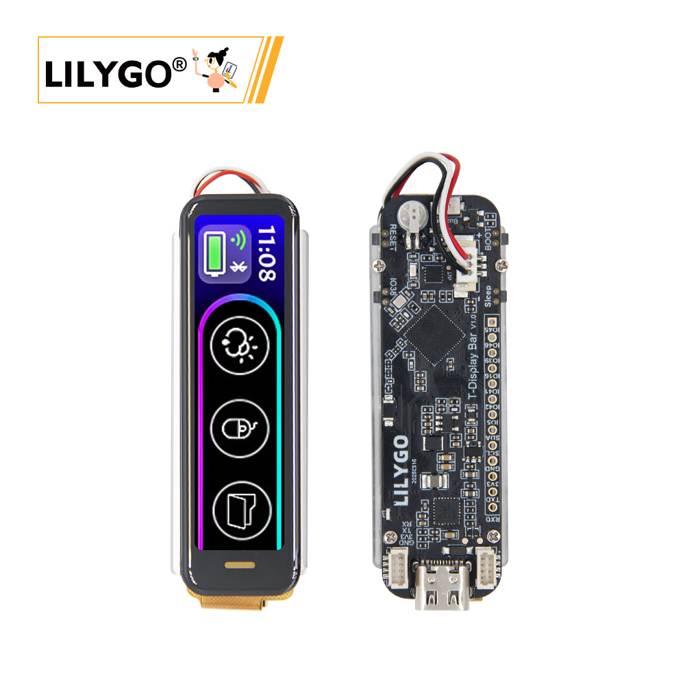

<!-- **[English](README.MD) | 中文** -->

    <a target="_blank" style="margin: 1em;color: white; font-size: 0.9em; border-radius: 0.3em; padding: 0.5em 2em; background-color:rgb(63, 201, 28)" href="https://lilygo.cc/products/t-display-bar">官网购买</a>
    <!-- <a target="_blank" style="margin: 1em;color: white; font-size: 0.9em; border-radius: 0.3em; padding: 0.5em 2em; background-color:rgb(63, 201, 28)" href="https://www.aliexpress.com/store/911876460">速卖通</a> -->

## 简介

LILYGO T-Display Bar 是一款高度集成化的嵌入式智能显示模组，核心搭载 ESP32-S3 高性能芯片，融合多功能传感器与高精度显示技术。其核心配置如下：

**显示系统**

* 配备 2.25英寸IPS全彩LCD屏，采用 ST7789驱动IC，分辨率为 76×284像素（RGB排列）。

* 支持 电容式触摸（独立Touch_IRQ/Touch_RST控制），提供流畅的人机交互体验。

* 通过SPI总线连接（CS/DC/RST/BL/MOSI/SCLK引脚），优化显示控制效率。

**智能感知能力**

* 集成 BH1260AP AI传感器，支持六轴IMU（加速度计+陀螺仪）及个性化运动追踪。

* 配备I²C接口（SDA/SCL）及专用控制引脚（EN/RST/IRQ），实现低功耗环境感知与实时数据交互。

**扩展性与接口**

* 提供 QWIIC生态接口（兼容I²C设备），支持快速扩展传感器模组。

* 集成 TF卡存储（SPI接口：MOSI/MISO/SCK/CS）及 蜂鸣器驱动（BUZZer_IO）。

* 采用 USB Type-C接口，支持 5V/500mA供电与程序烧录一体化设计。

**物理特性**

* 紧凑型结构设计（69×23×15mm），兼顾工业部署与便携设备需求。

* 引脚布局高度优化（如TFT CS/DC等复用ESP32-GPIO），简化二次开发流程。

## 外观及功能介绍
### 外观

### 引脚图 

## 模块资料以及参数

### 概述

| 组件 | 描述 |
| --- | --- |
| MCU | ESP32-S3R8 Dual-core LX7 microprocessor |
| FLASH| 16MB |
| PSRAM | 8MB|
| 屏幕 | 2.25 英寸 ST7789 IPS LCD (76*284px)|
| 触摸 | CST816 电容触摸屏 
| 传感器 | BHI260AP AI传感器  支持六轴IMU  蜂鸣器|
| LoRa | 1276:868,915Mhz |
| 存储 | TF 卡 |
| 无线 |2.4 GHz Wi-Fi & Bluetooth 5 (LE)
| USB | 1 × USB Port and OTG(TYPE-C接口) |
| IO 接口 | 2.54mm间距 13pin接口 |
| 拓展接口|  2 × QWIIC接口  +1 x 电池座子|
| 按键 | 1 x RESET 按键 + 1 x BOOT 按键 + 1 x IO38 按键+ 1 x Sleep 按键|
| 尺寸 | **69x23x15mm**  |

### 相关资料

Github：[T-Display-Bar](https://github.com/Xinyuan-LilyGO/T-Display-Bar)

#### 原理图

* [T-Display-Bar](https://github.com/Xinyuan-LilyGO/T-Display-Bar/blob/master/hardware/H764%20T-Display%20Bar_V1.1.pdf)

<!-- * [SY6970](./datasheet/AN_SY6970.pdf) -->

#### 依赖库

* [ESP32-BLE-Mouse](https://github.com/T-vK/ESP32-BLE-Mouse)
* [ArduinoJson](https://github.com/bblanchon/ArduinoJson)
* [lvgl](https://github.com/lvgl/lvgl)
* [MadgwickAHRS](https://github.com/arduino-libraries/MadgwickAHRS)
* [SensorsLib](https://github.com/lewisxhe/SensorsLib)
* [XPowersLib](https://github.com/lewisxhe/XPowersLib)
* [TFT_eSPI](https://github.com/Bodmer/TFT_eSPI)

## 软件开发
### Arduino 设置参数

| Arduino IDE Setting                  | Value                                |
|--------------------------------------|--------------------------------------|
| Board                                | ESP32S3 Dev Module                   |
| Port                                 | Your port                            |
| USB CDC On Boot                      | Enable                               |
| CPU Frequency                        | 240MHZ(WiFi)                         |
| Core Debug Level                     | None                                 |
| USB DFU On Boot                      | Disable                              |
| Erase All Flash Before Sketch Upload | Disable                              |
| Events Run On                        | Core1                                |
| Flash Mode                           | QIO 80MHZ                            |
| Flash Size                           | 16MB(128Mb)                          |
| Arduino Runs On                      | Core1                                |
| USB Firmware MSC On Boot             | Disable                              |
| Partition Scheme                     | 8M with spiffs(3M APP/1.5MB SPIFFS)  |
| PSRAM                                | OPI PSRAM                            |
| Upload Mode                          | UART0/Hardware CDC                   |
| Upload Speed                         | 921600                               |
| USB Mode                             | CDC and JTAG                         |

### 开发平台
1. [Micropython](https://micropython.org/)
2. [Arduino IDE](https://www.arduino.cc/en/software)
3. [Platform IO](https://platformio.org/)

## 产品技术支持 

