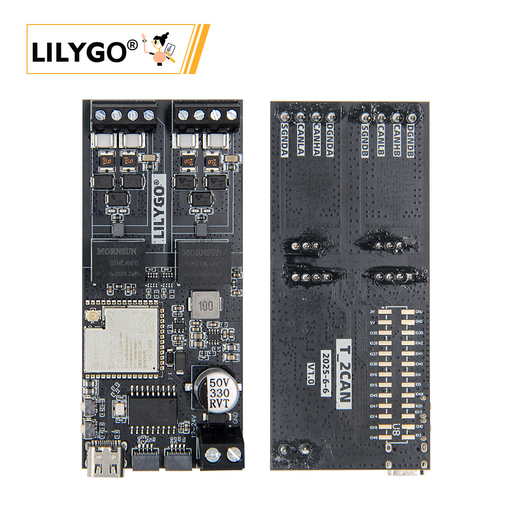

<!-- **[English](README.MD) | 中文** -->

    <a target="_blank" style="margin: 1em;color: white; font-size: 0.9em; border-radius: 0.3em; padding: 0.5em 2em; background-color:rgb(103, 175, 8)" href="https://lilygo.cc/products/t-2can">官网购买</a>
    <!-- <a target="_blank" style="margin: 1em;color: white; font-size: 0.9em; border-radius: 0.3em; padding: 0.5em 2em; background-color:rgb(63, 201, 28)" href="https://www.aliexpress.com/store/911876460">速卖通</a> -->

## 简介

LLYGO T-2CAN 是一款高性能、紧凑型嵌入式通信模块，基于强大的 ESP32-S3 微控制器（集成 Wi-Fi 与蓝牙 BLE 无线连接），并创新性地集成双路独立 MCP2515 CAN 总线控制器。该模块严格遵循 CAN 2.0B 协议标准，支持高达 1 Mb/s 的通信速率，提供两路完全独立的 CAN 通道接口（包含 CAN_H, CAN_L, 信号地 SGND 及电源地 DGND），满足工业级通信需求。
双路独立 CAN 接口： 通过两片 MCP2515 实现，每路配备 6 个 29 位验收滤波器及 2 个 29 位验收屏蔽码，确保高可靠性数据过滤与传输。

- 强大主控： ESP32-S3 提供充沛的处理能力及 Wi-Fi/BLE 无线连接选项，便于构建网络化应用。

- 工业级设计： 支持宽范围 DC 12-24V 电源输入，具备信号隔离设计（SGND/DGND），增强抗干扰能力。

- 丰富接口： 提供标准 SPI 接口连接主控，集成 USB Type-C（供电/编程）、IPEX 天线接口、QWIIC 扩展接口及复位/引导按钮。

- 紧凑尺寸： 约 18 x 39 x 91 mm，易于集成。

## 外观及功能介绍
### 外观

### 引脚图 

## 模块资料
### 概述。

| 组件 | 描述 |
| --- | --- |
| MCU | ESP32-S3-WROOM-1U（MCN16R8）
| FLASH| 16MB |
| PSRAM | 8MB |
| CAN | MCP2515 |
| USB | 1 × USB Port and OTG(TYPE-C接口) |
| 拓展接口 | 2 × CAN接口 + 2 x 2.54mm间隔 13pin接口 + 2 x QWIIC接口 |
| 按键 | 1 x RESET 按键 + 1 x BOOT 按键 |
| 电源 | 5V/500mA USB接口供电 12V~24V DC电源输入|
| 尺寸 | **18x39x91mm**  |

### 相关资料链接

Github:[T-2Can](https://github.com/Xinyuan-LilyGO/T-2Can)

- [TD501MCANFD](https://github.com/Xinyuan-LilyGO/T-2Can-Pro/blob/main/information/TD501MCANFD_MORNSUN.pdf)
- [TD501D485H-A](https://github.com/Xinyuan-LilyGO/T-2Can-Pro/blob/main/information/TD501D485H-A_K-CUT.pdf)

#### 原理图
[T-2Can](https://github.com/Xinyuan-LilyGO/T-2Can/blob/main/project/T-2Can_V1.0.pdf)

#### 依赖库
- [FastLED](https://github.com/FastLED/FastLED)

## 软件开发
### Arduino 设置参数

| Setting                  | Value                            |
|--------------------------|----------------------------------|
| Board                    | ESP32S3 Dev Module               |
| Upload Speed             | 921600                           |
| USB Mode                 | Hardware CDC and JTAG            |
| USB CDC On Boot          | Enabled                          |
| USB Firmware MSC On Boot | Disabled                         |
| USB DFU On Boot          | Disabled                         |
| CPU Frequency            | 240MHz (WiFi)                    |
| Flash Mode               | QIO 80MHz                        |
| Flash Size               | 16MB (128Mb)                     |
| Core Debug Level         | None                             |
| Partition Scheme         | 16M Flash (3MB APP/9.9MB FATFS)  |
| PSRAM                    | OPI PSRAM                        |
| Arduino Runs On          | Core 1                           |
| Events Run On            | Core 1                           |

### 开发平台
1. [VS Code](https://code.visualstudio.com/)
2. [Arduino IDE](https://www.arduino.cc/en/software)
3. [Platform IO](https://platformio.org/)

## 产品技术支持 

