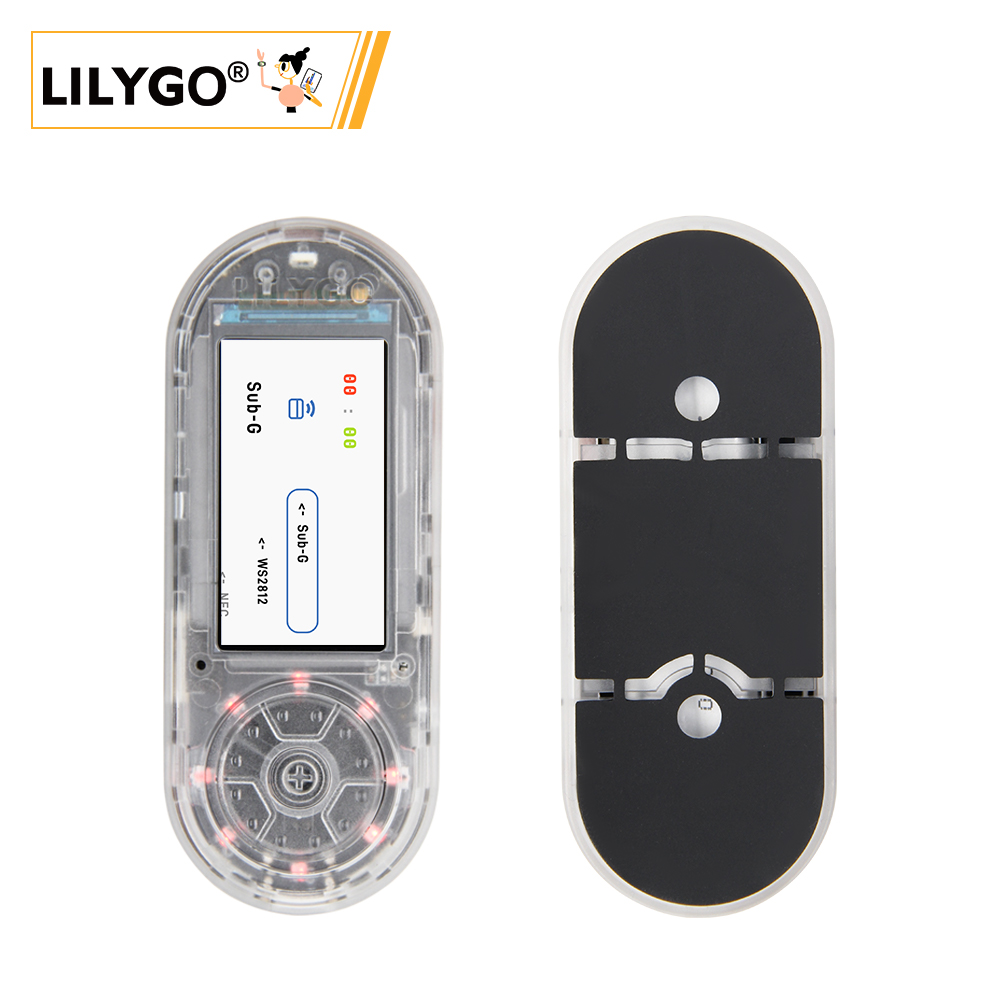

<!-- **[English](README.MD) | 中文** -->

<!-- 

    <a target="_blank" style="margin: 1em;color: white; font-size: 0.9em; border-radius: 0.3em; padding: 0.5em 2em; background-color:rgb(63, 201, 28)" href="https://item.taobao.com/item.htm?id=846226367137">淘宝</a>
    <a target="_blank" style="margin: 1em;color: white; font-size: 0.9em; border-radius: 0.3em; padding: 0.5em 2em; background-color:rgb(63, 201, 28)" href="https://www.aliexpress.com/store/911876460">速卖通</a>

 -->
> 点这里切换到[T-Embed-SI4732](https://wiki.lilygo.cc/get_started/zh/LCD_OLED/T-Embed-SI4732/T-Embed-SI4732.html)版本

## 简介

LILYGO T-Embed 是一款基于 ESP32-S3 并且搭载LX7双核处理器的高集成物联网开发板，专为多协议通信与智能硬件开发设计。其核心优势在于融合 LoRa、Sub-GHz（CC1101 模块）、NFC（PN532）、红外遥控 及 Wi-Fi 6/蓝牙 5.0，支持复杂场景下的无线连接需求，如远程传感（LoRa 超远传输）、智能家居控制（红外/NFC 门禁）及工业监控。开发板配备 1.9 英寸 TFT 屏幕（320x170 分辨率），支持动态数据显示与图形交互，搭配 旋转编码器 实现精准参数调节。此外，8 个可编程 RGB LED、麦克风与扬声器模块（支持语音交互）及 TF 卡扩展存储 进一步丰富了人机交互与数据处理能力。紧凑设计中优化引脚复用（如 SPI 总线共享），兼顾功能密度与开发灵活性，适用于智能家居中控、环境监测及教育级物联网原型开发，为开发者提供 开箱即用、多场景适配的高效硬件平台。

## 外观及功能介绍
### 外观

### 引脚图 

## 模块资料以及参数
### 开发板参数

| 组件 | 描述 |
| ---  | --- |
|MCU	|ESP32-S3 Dual-core LX7 microprocessor
|Flash 	|16M 
|PSRAM  |8M
|GPS	|MIA-M10Q
|无线| 	Wi-Fi 802.11 b/g/n，BLE 5
|存储 | TF 卡 |
|屏幕|  1.9 inch ST7789V IPS color TFT LCD
|Sub-G |	CC1101
|NFC	| PN532
|电池容量| 3.7V-1300mAh
|电池芯片| BQ25896, BQ27220
|开关	|支持电源开关
|LED 驱动	|WS2812
|按键 | 1 x RST 按键 + 1 x BOOT 按键 |
|音频	|ES7210
| USB |1 × type-C接口|
|红外 |支持红外
|UI | LVGL
| 拓展接口 | 2 × QWIIC接口 |
| 孔位 | 2×2mm 定位孔 |
| 尺寸 | **97.5x39x31mm**  |
### 相关资料
Github：[T-Embed-CC1101](https://github.com/Xinyuan-LilyGO/T-Embed-CC1101)

* [PN532](https://github.com/Xinyuan-LilyGO/T-Embed-CC1101/blob/master/hardware/PN532_C1.pdf)
* [bq25896](https://github.com/Xinyuan-LilyGO/T-Embed-CC1101/blob/master/hardware/bq25896.pdf)
* [bq27220](https://github.com/Xinyuan-LilyGO/T-Embed-CC1101/blob/master/hardware/bq27220_datasheet.pdf)
* [cc1101](https://github.com/Xinyuan-LilyGO/T-Embed-CC1101/blob/master/hardware/cc1101.pdf)

#### 原理图

[T-Embed-CC1101](https://github.com/Xinyuan-LilyGO/T-Embed-CC1101/blob/master/hardware/T-Embed-CC1101%20V1.0%2024-07-29.pdf)

<!-- * [SY6970](./datasheet/AN_SY6970.pdf) -->

#### 依赖库

* [RadioLib](https://github.com/jgromes/RadioLib)
* [PN532](https://github.com/Seeed-Studio/PN532.git)
* [XPowersLib](https://github.com/lewisxhe/XPowersLib)
* [TFT_eSPI](https://github.com/Bodmer/TFT_eSPI)
* [RotaryEncoder](http://www.mathertel.de/Arduino/RotaryEncoderLibrary.aspx)
* [FastLED](https://github.com/FastLED/FastLED)
* [IRremoteESP8266](https://github.com/crankyoldgit/IRremoteESP8266)
* [ESP32-audioI2S](https://github.com/schreibfaul1/ESP32-audioI2S)
* [LVGL](https://github.com/lvgl/lvgl/tree/v8.4.0)

## 软件开发
### Arduino 设置参数

| Arduino IDE 设置  | Value      |
| --------------- | ------------------ |
| Board      | **ESP32S3 Dev Module**            |
| Port           | Your port                   |
| USB CDC On Boot          | Enable                    |
| CPU Frequency           | 240MHZ(WiFi)                 |
| Core Debug Level        | None                     |
| USB DFU On Boot         | Disable                           |
| Erase All Flash Before Sketch Upload | Disable        |
| Events Run On       | Core1            |
| Flash Mode       | QIO 80MHZ                         |
| Flash Size       | **16MB(128Mb)**                   |
| Arduino Runs On    | Core1          |
| USB Firmware MSC On Boot  | Disable           |
| Partition Scheme    | **16M Flash(3M APP/9.9MB FATFS)** |
| PSRAM    | **OPI PSRAM**           |
| Upload Mode       | **UART0/Hardware CDC**            |
| Upload Speed    | 921600                            |
| USB Mode         | **CDC and JTAG**                  |
  

### 开发平台
1. [ESP-IDF](https://www.espressif.com/zh-hans/products/sdks/esp-idf)
2. [Arduino IDE](https://www.arduino.cc/en/software)

## 产品技术支持 

